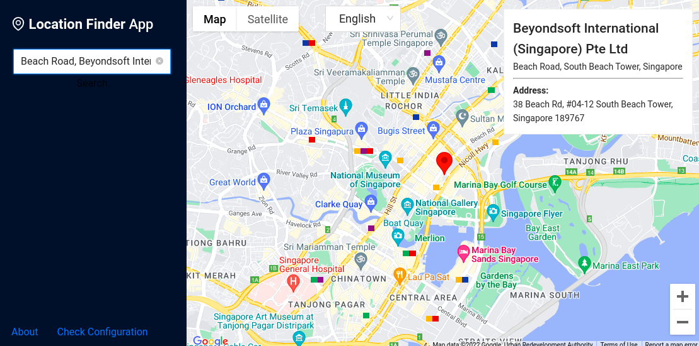

# Location Finder App

A sample application for [gmaps-script-loader](https://www.npmjs.com/package/gmaps-script-loader) react hook on React + redux-observable epic+ Google Maps. This project was bootstrapped with [Create React App](https://github.com/facebook/create-react-app), using the [Redux](https://redux.js.org/) and [Redux Toolkit](https://redux-toolkit.js.org/) template.



## Installing / Getting started

### 1. Get the code

You can start by cloning the repo on your local machine by running:

```sh
$ git clone https://github.com/yohaneslumentut/location-finder.git
$ cd location-finder
```

### 2. Install the dependencies

```sh
$ yarn install
```

### 3. Update `.env` file

Rename `.env.sample` into `.env` and update with your own API keys:

```
REACT_APP_GOOGLE_MAPS_API_KEY=xxxxxxxxxxxxxxxxxxxxxxxxxxxxxxxxxxxxxx   <--- change with your API_KEY
REACT_APP_API_REGISTRY_KEY=0akdqnt7nu7kswdb
```

### 4. Run the app

Runs the app in the development mode.

```sh
$ yarn start
```

### 5. View it in action

Then open `http://localhost:3000` to view it in the browser

## Demo

- https://location-finder-phi.vercel.app

## Licensing

MIT
